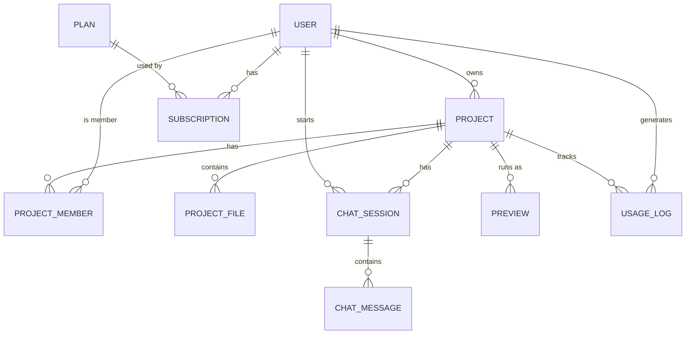

# 💜 Lovable Clone

> _"Describe it. Watch it get built."_ ✨
> An AI app builder, inspired by [Lovable](https://lovable.dev), that I'm building from scratch with **Spring Boot**. 🚀


---

## 👋 What is this?

Hey there! I'm **Monji**, and this is my take on a **Lovable-style AI app builder**. You chat with an AI, it writes the code for you, and you get a live preview of your app. 🪄

I'm building it one layer at a time, and this README grows as the project does. 🌱

---

## 📍 Where we're at right now

| Stage | Status |
| --- | --- |
| 🏗️ Project scaffolding (Spring Boot + Maven) | ✅ Done |
| 🧱 Domain model (entities + enums) | ✅ Drafted |
| 🗄️ JPA mappings (`@Entity`, relations, IDs) | 🔜 Up next |
| 📦 Repositories | ⏳ Planned |
| 🧠 Services & business logic | ⏳ Planned |
| 🌐 REST controllers | ⏳ Planned |
| 🔐 Auth & security | ⏳ Planned |
| 🤖 AI / LLM integration | ⏳ Planned |
| 💳 Stripe billing | ⏳ Planned |
| 🐳 Live previews (Kubernetes pods) | ⏳ Planned |
| 🪣 File storage (MinIO) | ⏳ Planned |

> 💡 **Heads up:** the entities are plain Java classes with Lombok for now. JPA annotations and relationships come in the next step.

---

## 🧰 Tech Stack

- ☕ **Java 21**
- 🍃 **Spring Boot 4.0.0** (Web MVC + Data JPA)
- 🐘 **PostgreSQL** (runtime driver)
- 🌶️ **Lombok**, so I write less boilerplate
- 📦 **Maven** (wrapper included, nothing to install)

Coming later: 🤖 an LLM provider · 💳 Stripe · 🪣 MinIO · ☸️ Kubernetes

---

## 🗺️ Domain Model

Here's the data that will power the app:



### 🧩 Entities

| Entity | What it does |
| --- | --- |
| 👤 `User` | An account holder: email, password hash, name, avatar. Supports soft delete. |
| 📁 `Project` | An app being built. Has an owner, can be public or private, supports soft delete. |
| 🤝 `ProjectMember` | Who can collaborate on a project and in what role. Uses a composite key (`ProjectMemberId`). |
| 📄 `ProjectFile` | A file in a project. The path is stored here and the content lives in MinIO (`minioObjectKey`). |
| 💬 `ChatSession` | A conversation thread between a user and the AI about a project. |
| 🗨️ `ChatMessage` | A single message in a session, including role, tool calls (JSON), and tokens used. |
| 👀 `Preview` | A live running preview of a project. Tracked by K8s namespace, pod name, and URL. |
| 💎 `Plan` | A pricing tier with limits on projects, daily tokens, and previews, plus an unlimited-AI flag. Linked to a Stripe price. |
| 🧾 `Subscription` | A user's subscription to a plan, synced with Stripe (customer and subscription IDs, billing period). |
| 📊 `UsageLog` | A record of each AI action: tokens used, duration, and metadata such as the model and prompt. |

### 🏷️ Enums

| Enum | Values |
| --- | --- |
| `MessageRole` | `USER` · `ASSISTANT` · `SYSTEM` · `TOOL` |
| `PreviewStatus` | `CREATING` · `RUNNING` · `FAILED` · `TERMINATED` |
| `ProjectRole` | `EDITOR` · `VIEWER` |
| `SubscriptionStatus` | `ACTIVE` · `TRIALING` · `CANCELED` · `PAST_DUE` · `INCOMPLETE` |

---

## 📂 Project Structure

```
lovable-clone/
├── 📄 pom.xml
├── 🔧 mvnw / mvnw.cmd
└── src/
    ├── main/
    │   ├── java/com/monji/projects/lovable_clone/
    │   │   ├── 🚀 LovableCloneApplication.java
    │   │   ├── 🧱 entity/      → domain classes
    │   │   └── 🏷️ enums/       → status & role enums
    │   └── resources/
    │       └── ⚙️ application.yaml
    └── test/
        └── 🧪 LovableCloneApplicationTests.java
```

---

## 🏃 Getting Started

### ✅ Prerequisites
- ☕ JDK 21+
- 🐘 A running PostgreSQL instance (you'll need it once the DB config is added)

### ▶️ Run it

```bash
# 🐧 macOS / Linux
./mvnw spring-boot:run

# 🪟 Windows
mvnw.cmd spring-boot:run
```

### 🧪 Test it

```bash
./mvnw test
```

> ⚠️ The datasource isn't configured in `application.yaml` yet, so the app will complain about a missing database until that's added. Stay tuned! 🔧

---

## 🛣️ Roadmap

- [x] 🏗️ Bootstrap the Spring Boot project
- [x] 🧱 Sketch the domain entities & enums
- [ ] 🗄️ Add JPA annotations + PostgreSQL config
- [ ] 📦 Repositories, services, DTOs
- [ ] 🌐 REST APIs for projects, files & chat
- [ ] 🔐 JWT authentication
- [ ] 🤖 AI code generation with tool calling
- [ ] 🪣 MinIO file storage
- [ ] ☸️ Kubernetes-powered live previews
- [ ] 💳 Stripe subscriptions & usage limits

---

## 🙌 Credits

Built with ❤️, ☕, and a lot of 🐛 squashing by **Monji** as part of the _Spring Boot 0 → 100_ course journey.

⭐ If you like where this is going, drop a star! ⭐
